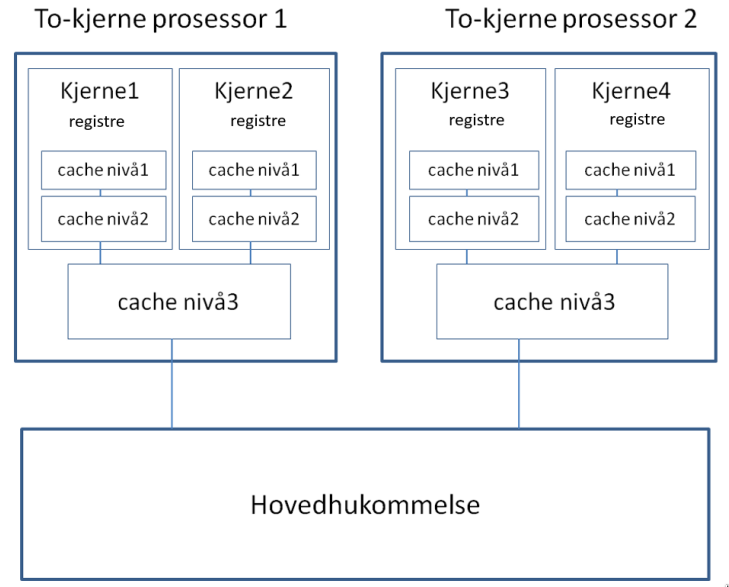
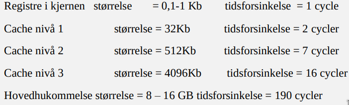

## Random
Speed of light: 299 792 458 m/s
finally {} may not be executed if a thread is interrupted inside catch, e.g. `try { ... } catch { Thread.currentThread().interrupt(); } finally { ... }`
Remember to comment code
1 second = 1 000 000 000 nanoseconds
Read all questions before answering any of them

## Cache friendliness of bubblesort
```java
static void bubbleSort(int array[]) {
    int size = array.length;
    for (int i = 0; i < size - 1; i++)
        for (int j = 0; j < size - i - 1; j++)
            if (array[j] > array[j + 1]) {
                int temp = array[j];
                array[j] = array[j + 1];
                array[j + 1] = temp;
            }
}
```
### Good (In general)
- Sequential access to the array.
- Temporal locality: frequently accesses the same elements within a short period of time
- Spatial locality: frequently accesses adjacent elements in array
### Bad (In general)
- Generally inefficient algorithm with O(n^2) complexity (not necessarily bad, but we know bubblesort is inefficient)
- Nested for loop means that after each inner for loop completes it will jump back to the start of the array (jumping around in memory is bad)
- Cache saturation: when array size is larger than the cache size the cache may need to evict data that may be needed later (more overhead for managing cache + future cache misses is bad)
### Bad (This implementation)
- Inefficient inner loop: restarting j at 0 and looping up to size - i - 1 in the inner loop is a cache inefficient way to do the bubblesort algorithm. This solution will result in a lot of jumping around in memory when going from the outer to the inner loop which will likely result in cache misses for larger arrays.
### Improvements (In general)
- Even though a better solution for an algorithm is not necessarily always more cache friendly there is generally a correlation, we can say that this is mostly due to cache saturation. More efficient algorithms do fewer operations for the same result, leading to less cache saturation. This is especially true for larger datasets. Since there is very little inherently cache inefficient with the bubble sort algorithm, we can say that any speedups that maintain the `identity` of the bubble sort algorithm is an improvement.
- Parallelism: If we were to parallelize the algorithm we could reduce the cache saturation. The benefit of this would vary depending on both amount of threads and the size of the array, where larger arrays and more threads are benefitial. The sweetspot here would be if we could splice the array to perfectly fit the size of a cache line for each thread (there is also a sweetspot for a not). In terms of implementing this we would end up with an array where it contains several sorted subarrays. We could then run something like mergesort on these subarrays. This (sort of) maintains the integrity of still being the bubblesort algorithm.

Mergesort version is not good!!! Try to stay loyal to the algorithm -> nopass. Start threads bubblesorting the array from 0..N-1, each thread containing an ID where no thread with a higher ID (started later) can pass a thread with a lower ID (Sort of like having several sliding windows). Next sort from 0..N-2, etc., until N==1.

Bubblesort is good when an array is almost sorted.

### Improvements (This implementation)
- Switch inner for loop to range from `j = i .. j < size - 1`
```java
// Improved version
static void bubbleSort(int array[]) {
    int size = array.length;
    for (int i = 0; i < size - 1; i++)
        for (int j = i; j < size - 1; j++)
            if (array[j] > array[j + 1]) {
                int temp = array[j];
                array[j] = array[j + 1];
                array[j + 1] = temp;
            }
}
```

## NoPass - Parallel bubblesort
We can define a new synchronization method, let us call it NoPass, that works as follows: Each thread involved in the synchronization is given a unique id, which is merely a nonnegative integer assigned consecutively from zero and up, so if there are N threads involved, the ids will be from zero to N-1. When a thread calls the method NoPass(id), the thread gives its id, and first NoPass checks whether or not there is a thread with an id of id+1 that is blocked and has called NoPass FEWER times than the thread with id of id. If so, it unblocks that thread. Second, the thread checks whether or not there is any thread with a lower id that has called NoPass a FEWER OR THE SAME number of times than the thread with id of id. If so, the thread with id of id blocks itself. NoPass thus ensures that no thread with a higher id ever catches up with any thread that has a lower id. Assume that we have a class NoPassC that implements this type of synchronization. The class has one public method, NoPass(id), as described above. Describe an efficient, parallel version of BubbleSort that uses the NoPass synchronization mechanism described previously.

To make a parallel version of bubblesort with the `nopass` synchronization method we can make a sort of pipeline. We could assign each thread a slice of the array and give them the responsibility of bubbling the largest elements in their slice to the end. This could be done in parallel and after each thread is done sorting their slice they could call the nopass method ensuring they will wa

## IVar
This implementation makes two semaphores, one for getting the internal value and one for setting/putting the internal value. The get semaphore is initialized to have 0 permits, meaning acquiring the semaphore will be blocking until it gets released. On the other hand the put semaphore is initalized with 1 permit meaning acquiring the semaphore will not be blocking for the first caller. The put semaphore may not be necessary depending on the usage of the class, but it ensures that the class is fully thread safe even if put is called on separate threads.

This ensures thread safe concurrent access to IVar objects because the get function will block until the get semaphore is released which is only done inside the put method - more specifically only inside the put method when isSet is false which is only the first call to the put method. The put method is also thread safe as the put semaphore is only initialized with 1 permit and the put method starts with an acquiration and ends with a releasing of this semaphore. However according to the docs the finally {} block is not guaranteed to be executed if the thread is interrupted, though it seems to execute in most environments - this problem is probably outside the scope of this question anyways.

There is also a veeeery small chance that the threads calling the get method will be blocked if more than Integer.MAX_VALUE threads call the method at the same time. In this case some threads will have to wait for their turn, however this limitation is virtually irrelevant since you would probably never need more than Integer.MAX_VALUE concurrent accesses to an IVar and even so it would not result in a substantial slowdown unless you want orders of magnitude larger than Integer.MAX_VALUE accesses, which would just be absurd.
```java
import java.util.concurrent.*;

class IVar<T> {
    private final Semaphore getSem;
    private final Semaphore putSem;
    private boolean isSet;
    private T value;

    public IVar() {
        this.getSem = new Semaphore(0);
        this.putSem = new Semaphore(1);
        this.isSet = false;
    }

    public boolean put(T value) {
        try {
            putSem.acquire();
            if (!isSet) {
                this.value = value;
                getSem.release(Integer.MAX_VALUE);
                isSet = true;
                return true;
            } else {
                return false;
            }
        } catch (InterruptedException e) {
            Thread.currentThread().interrupt();
            return false;
        } finally {
            putSem.release();
        }
    }

    public T get() {
        try {
            // We dont need to do anything between acquiring and releasing -
            // this is only to block the thread until it gets released by
            // a call to `put`
            getSem.acquire();
            getSem.release();
        } catch (InterruptedException e) {
            Thread.currentThread().interrupt();
        }
        return value;
    }

    // Below is just to test the class
    // Worker is unused, but something similar may be useful so keep it
    static class Worker implements Runnable {
        int id;
        IVar<Integer> ivar;

        public Worker(int id, IVar<Integer> ivar) {
            this.id = id;
            this.ivar = ivar;
        }

        public void run() {
            System.out.println(id);
            try {
                if (id == 0) {
                    TimeUnit.SECONDS.sleep(2);
                    ivar.put(1);
                } else {
                    System.out.println(ivar.get());
                }
            } catch (Exception e) {
            }
        }
    }

    public static void main(String[] args) {
        // This main method uses assert which needs to be enabled with the `-ea` command
        // line flag, alternatively we could do some similar logic in an if block and
        // throwing an AssertionError.
        //
        // This test covers the common usage of an ivar. In chronological order it does:
        // 1. 2 threads request the value from the ivar, which will block the threads
        // until the ivar gets set. This tests concurrent access to the get method.
        // 2. 1 thread sets the value of the ivar. This tests the put method
        // 2a the 2 threads requesting it gets unblocked. This tests the unblocking of
        // the getter threads.
        // 3. Another thread tries to set the ivar. This tests the semi write only
        // property of the class.
        IVar<Integer> ivar = new IVar<>();
        int expected = 5;

        Thread t1 = new Thread(() -> {
            try {
                TimeUnit.SECONDS.sleep(2);
            } catch (Exception e) {
            }
            boolean success = ivar.put(expected);
            assert success == true : "First call to `put` failed";
            System.out.println(Thread.currentThread().getName() + " successfully called `put`");
        });

        // Threads 2 and 3 will do the same thing and expect the same output so lets
        // create a shared variable for this. Reason we make two threads is just to test
        // that multiple threads calling get concurrently works as expected.
        Runnable testGet = () -> {
            long before = System.nanoTime();
            Integer i = ivar.get();
            long after = System.nanoTime();
            assert after > before + 2000000000 : "Call to `get` didn't block as expected";
            System.out.println(Thread.currentThread().getName() + " blocked for a reasonable amount of time");
            assert i == expected : "Unexpected value in ivar: " + ivar.value;
            System.out.println(Thread.currentThread().getName() + " got the expected value from `get`: " + expected);
        };

        Thread t2 = new Thread(testGet);
        Thread t3 = new Thread(testGet);

        Thread t4 = new Thread(() -> {
            // Here we assume that `t4` will call `put` after `t1` which is probably always
            // going to be true. However it is technically possible that it could end up
            // before `t1` if the sleep gets interrupted or something makes t1 run
            // criminally slowly. Despite that this test should suffice for most cases.
            try {
                TimeUnit.SECONDS.sleep(5);
            } catch (Exception e) {
            }
            boolean success = ivar.put(10);
            assert success == false : "Second call to `put` succeeded when it shouldn't";
            System.out.println(
                    Thread.currentThread().getName() + " failed to update the value in the ivar (expected behavior)");
        });
        t1.start();
        t2.start();
        t3.start();
        t4.start();

        try {
            t1.join();
            t2.join();
            t3.join();
            t4.join();
        } catch (Exception e) {
        }

        assert ivar.value == expected : "Unexpected value in ivar: " + ivar.value;
        System.out.println("After joining threads ivar still has expected value: " + expected);

        System.out.println("All tests succeeded :)");
    }
}
```

## Threads
- Can threads spawned by the main thread spawn new threads? - Yes because there is nothing (/very little) special about the main thread except for the fact that it is the thread that gets assigned to do the `main`. Any thread can spawn another thread. Related: A java program terminates when the main thread has terminated AND any threads spawned by the main thread has terminated AND any threads spawned by threads spawned by the main thread has terminated.
- How can 100 java threads appear to execute concurrently on a 4 core machine? - This is up to the JVM and the operating system's scheduler to schedule time slices for each of the running threads so that they all get assigned time to execute their tasks. The operating system will also have to manage context switches between the different threads. In practice this means that the threads will regularly have to temporarily pause their execution to allow other threads access to the physical hardware. Even if you were to only create 4 java threads on a 4 core machine, it is unlikely that this would lead to true uninterrupted physical concurrency as there is almost always some other program running on the system that needs to do work on the processor which would have to interrupt the threads in your java program.

## `synchronized`
- Pros and cons of some alternative to `synchronized` - My actual favorite alternative to synchronized would be to avoid it, because using it or any of its alternatives is usually a lot slower than storing data locally in each thread and then later sequentially synchronizing the data after the threads have finished. However if I were to use an alternative to synchronized I would say a lock like javas `ReentrantLock` is quite nice. 
    - Pros:
        - As opposed to synchronized locks allows us to localize the synchronization to the lines where its needed instead of locking the entire function when its called. This gives the programmer more control over the program.
        - More flexible methods for handling interruptions. Also allows you to check if a lock is being held.
        - Can be fair (First In First Out) if fairness parameter is set to true.
    - Cons:
        - Harder to implement, more prone to bugs and errors.
        - Needs to be imported
        - Needs try/finally
        - Slower(?)

## Semaphores
Semaphore(0) means there are no permits until it gets release()'d. A semaphore is just a lock that maintains an intial state of how many permits there are. Constructor param is just the initial number of permits.
### JoinP - join using Semaphores
```java
import java.util.concurrent.*;

// Worse version:
// Three semaphores. `running` semaphore which is effectively a counter for
// how many threads are currently running. `mainSem` the semaphore for the
// main thread, releasing this is a signal for the main thread to continue.
// `checkRunning` which is a semaphore to stop race conditions when checking
// how many permits are available in `running`.
class JoinP {
    static final int numberofthreads = 10;
    static Semaphore running = new Semaphore(numberofthreads);
    static Semaphore checkRunning = new Semaphore(1); // In most cases unnecessary, but to remove all possible race
                                                      // conditions I added this
    static Semaphore mainSem = new Semaphore(1);

    public static void main(String[] args) {
        Thread[] t = new Thread[numberofthreads];

        for (int j = 0; j < numberofthreads; j++) {
            (t[j] = new Thread(new ExThread())).start();
        }

        try {
            mainSem.acquire();
        } catch (Exception e) {
            return;
        }
    }

    static class ExThread implements Runnable {
        public void run() {
            try {
                running.acquire();
                TimeUnit.SECONDS.sleep(10);
                running.release();

                checkRunning.acquire();
                // If all threads are done release main thread
                if (running.availablePermits() == numberofthreads)
                    mainSem.release();
                checkRunning.release();
            } catch (Exception e) {
                return;
            }
        }
    }
}

// Improved version:
// One semaphore. The main thread acquires the semaphore`numberOfThreads` times
// meaining it can't continue until the semaphore has been released `numberOfThreads`
// times. Effectively making it `join` until all threads are finished
class JoinP {
    static final int numberOfThreads = 10;
    static Semaphore s = new Semaphore(0);

    public static void main(String[] args) {
        Thread[] threads = new Thread[numberOfThreads];

        for (int j = 0; j < numberOfThreads; j++) {
            (threads[j] = new Thread(new ExThread())).start();
        }

        try {
            s.acquire(numberOfThreads);
        } catch (InterruptedException e) {
            Thread.currentThread().interrupt();
            return;
        }
    }

    static class ExThread implements Runnable {
        public void run() {
            try {
                TimeUnit.SECONDS.sleep(10);
                s.release();
            } catch (InterruptedException e) {
                Thread.currentThread().interrupt();
            }
        }
    }
}
```
## Prefetching
When youre accessing data the likelyhood youre going to need data sequentially after it is high so the computer can prefetch this data so that it doesnt have to wait for the slow speed of light to get it - it's better to already have it ready.

## Sorting algorithms
```c
void arr_swap(void *arr, int i, int j, size_t type_size) {
  char temp[type_size];

  // Copy contents of a[i] into temporary buffer
  memcpy(temp, arr + i * type_size, type_size);
  // Copy a[j] into a[i]
  memcpy(arr + i * type_size, arr + j * type_size, type_size);
  // Copy contents of temp into a[j]
  memcpy(arr + j * type_size, temp, type_size);
}

// NOTE: if we move the second condition in the inner loop into an if statement
// we could remove the swapped varable and make it purely iterative. This would
// mean each inner loop would be a lot longer however.
void bubblesort(int *arr, int size) {
  char swapped = 0;
  // Loop through each number
  for (int i = 0; i < size; ++i) {
    // Propogate as far down the array as we can one index at a time
    // (We could also use an if test to only swap once, but then we would
    // just have to do more recursive calls instead)
    for (int j = i; j < size - 1 && arr[j] > arr[j + 1]; ++j) {
      arr_swap(arr, j, j + 1, sizeof(int));
      swapped = 1;
    }
  }

  if (swapped)
    // After one full iteration of the array, we know we have moved at least one
    // element to the end of the array, so we can decrement the size for the
    // next recursive call
    bubblesort(arr, size - 1);
}

void insertionsort(int *arr, int size) {
  for (int i = 1; i < size; ++i)
    for (int j = i; j > 0 && arr[j - 1] > arr[j]; --j)
      arr_swap(arr, j - 1, j, sizeof(int));
}

void quicksort_impl(int *arr, int start, int end) {
  // basecase
  if (start >= end)
    return;

  // Choose pivot element (here just use the last element in the array)
  int pivot = arr[end - 1];

  int left_i = start;
  int right_i = end - 2;
  // Increment left_i until arr[left_i] is greater than pivot
  while (left_i < end - 1 && arr[left_i] < pivot)
    ++left_i;
  // Decrement right_i until arr[right_i] is less than pivot
  while (right_i > 0 && arr[right_i] >= pivot)
    --right_i;

  if (left_i < right_i) {
    // If left_i < right_i there are still more elements smaller than the pivot
    // that need to be moved to the front of the array
    arr_swap(arr, left_i, right_i, sizeof(int));
    quicksort_impl(arr, start, end);
  } else {
    // Otherwise we are done with this partition and we continue splitting
    // the array into 2 new partitions and sort them
    arr_swap(arr, left_i, end - 1, sizeof(int)); // swap left with pivot
    quicksort_impl(arr, start, left_i);
    quicksort_impl(arr, left_i + 1, end);
  }
}

void quicksort(int *arr, int size) { quicksort_impl(arr, 0, size); }

void selectionsort(int *arr, int size) {
  // Index of smallest number seen in current iteration
  int min_i = 0;
  for (int i = 0; i < size;) {
    for (int j = i; j < size; ++j)
      if (arr[j] < arr[min_i])
        min_i = j;

    arr_swap(arr, min_i, i, sizeof(int));
    min_i = ++i;
  }
}
```

## CPU



**Cache-linje størrelsen** Når cache-systemet leser data fra hovedhukommelsen opp til nivå 3, så nivå 2
og til sist nivå1 cache, er det ikke én byte av gangen, men 64 byte hver gang (fordi det tar så lang tid,
er det fordelaktig å laste opp mer enn det det er bedt om). Hvis programmet før eller siden trenger
disse bytene, ser vi at programmet vil gå mye raskere enn om man skulle gå helt ned i hovedlageret
hver gang programmet trengte neste heltall, flyttall eller neste byte.

**Prefetch mekanismen** Hvis programmet leser eller skriver tilfeldige adresser i en stor array med én
indeks (større enn L3 cachen): `a[i]` , `a[k]`, `a[j]`, `a[m]`,. .. så vil dette gå vesentlig langsommere enn
sekvensiell aksess: `a[i]`, `a[i+1]`, `a[i+2]`,... Spesielt oppstår denne effekten når vi leser bortover radene i
en i en litt større to-dimensjonal array (så stor at det ikke er plass til hele arrayen i L2 eller L3
cachen), og programmet leser f.eks. `a[i,j]`, `a[i,j+1]`, `a[i,j+2]` vil en mekanisme i prosessorkjernen starte
å lese neste cache-linje på 64 byte før programmet har bedt om det selv. Dette gjør at programmet
går vesentlig raskere – mindre venting på data fra hovedhukommelsen. Denne mekanismen virker
like bra hvis vi leser radene i en array baklengs fra slutten mot begynnelsen.
Merk at dette gjelder radvis lesing av en array. Leses derimot arrayen kolonne-vis (`a[i, j]` `a[i+1,j]` ,
`a[i+2,j]`, .. vil elektronikken måtte lese en ny cache-linje for hver aksess, og vi vil få ingen hjelp av at vi
allerede har lest 64 byter i cache-linjen som inneholder `a[i, j]` og prefetch-mekanismen gjenkjenner
ikke dette som sekvensiell lesing. Lesing av neste kolonne-element vil derfor medføre at hver gang
foretas en ny lesing ‘helt’ fra hovedlageret med en forsinkelse på ca. 100 nano-sekunder mot lesning
av L1 cachen på 2 nanosekunder for radvis lesing av hvert element. En ‘bom’ på hva vi skal lese neste
gang kalles en cache-miss.

**Pipeline**: Ikke alle maskininstruksjoner tar like lang tid, og de er da delt opp i flere mikroinstruksjoner
som samlet sett løser oppgaven som den større instruksjonen skal løse – f.eks. divisjon. En kjerne vil
da ved neste klokke-tikk prøve å starte første mikroinstruksjon i neste instruksjon, så igjen ved neste
tikk neste instruksjon, ... osv. Kjernen kan holde da på med å beregne typisk inntil 5 maskininstruksjoner samtidig på forskjellige grader av fullføring. Dette kalles en ‘pipeline’.

**Trådbytte (context switch?)**: er når en tråd som utføres på en av kjernene avbrytes, og en annen tråd overtar kjernen
og kjører sitt program på denne kjernen. Den tråden som holdt på med sine beregninger må stoppes
og innehold av de registrene som denne avbrutte tråden hadde til sine beregninger må lagres i
hukommelsen. Så kan register-innholdet til den nye tråden lastes opp fra der den andre tråden
hadde lagt sitt registerinnhold. Først når registerinnholdet fra den nye tråden er i registrene, dvs.
hvor den var i programmet og hva den foreløpig har regnet ut, kan denne nye tråden startes. Når vi
har langt flere tråder enn vi har kjerner i en prosessor, og det har vi alltid når vi teller med de langt
over 1000 tråder vi har i operativsystemet, så må de ulike trådene bytte om på å kjøre på kjernene.
Selv om operativsystemets tråder i sum ikke bruker mer enn ca. 10% av prosessoren klokkesykler
fordi de i all hovedsak venter på I/O eller andre begivenheter, så tar de noe tid. Også, hvis ingen tråd
ønsker å kjøre på en prosessor, er det et enkelt lite program som kjøres: idle-løkken- det enkleste
program vi kan tenke oss som bare går rundt i en evig løkke, og som med en gang vil foreta trådbytte
med en tråd som har noe å gjøre. Når idle-løkken kjøres vil også prosessoren søke å redusere
klokkehastigheten slik at den sparer strøm. Den PC-en som noen av eksemplene i dette kompendiet
er kjørt på kan variere klokkehastigheten mellom 1.2 GHz og opp til 4.2GHz. Kort sagt: prosessoren
med sine kjerner stopper aldri, og kjernene bytter ofte om på å kjøre de ulike trådene.

**Spekulative beregninger** Når koden som utføres inneholder en test (i f.eks. if- while eller for-løkke)
inneholder kjernen ekstra registre og elektronikk slik at den starter med å regne på begge grenene av
utfallet av testen – både om testen kommer til å gi sann eller falsk. Når testen er ferdig beregnet, vil 
9
kjernen beholde beregningene som fulgte etter den beregningen med det riktige sanne svaret på
testen og fortsette der. Beregningene som fulgte etter at testen fikk det gale svaret vil bli strøket

## Assignments

### Assignment 1 - KLargestNumbers
```java
public class KLargestNumbers {
    public int[] nums;
    public int k;
    private class KLargestInInterval implements Runnable {
        private final int start;
        private final int end;

        public KLargestInInterval(int start, int end) {
            this.start = start;
            this.end = end;
        }

        public void run() {
            insertSortDescending(start, start + k);

            for (int i = start + k; i < end; i++) {
                if (nums[i] > nums[start + k - 1]) {
                    insertLargeNumber(start, k, nums[i]);
                }
            }
        }
    }

    public KLargestNumbers(int[] nums, int k) {
        this.nums = nums;
        this.k = k;
    }

    /**
     * Move this.k largest elements of this.nums to its front in place
     * using a sequential algorithm (KLargestInInterval.run on the entire array)
     */
    public void findKLargestSequential() {
        new KLargestInInterval(0, nums.length).run();
    }

    /**
     * Move this.k largest elements of this.nums to its front in place
     * using a parallel algorithm
     */
    public void findKLargestParallel() {
        final int cores = Runtime.getRuntime().availableProcessors();
        final int intervalSize = nums.length / cores;

        // Algorithm doesnt make sense if k is too close to the size of the array.
        // In this case just sort the whole array instead
        if (k >= intervalSize) {
            insertSortDescending(0, nums.length - 1);
            return;
        }

        final Thread[] threads = new Thread[cores];
        int start = 0;
        for (int i = 0; i < cores - 1; i++) {
            threads[i] = new Thread(new KLargestInInterval(start, start + intervalSize));
            threads[i].start();

            start += intervalSize;
        }
        // Last thread searches to the end of the array in case nums.length % cores > 0
        threads[cores - 1] = new Thread(new KLargestInInterval(start, nums.length - 1));
        threads[cores - 1].start();

        try {
            for (int i = 0; i < threads.length; i++) {
                threads[i].join();
            }
        } catch(Exception e) {
            System.out.println(e);
            System.exit(1);
        }

        pushLargestToFront(threads.length, intervalSize);
    }

    private void pushLargestToFront(int intervals, int intervalSize) {
        for (int i = 1; i < intervals; i++) {
            int start = i * intervalSize;

            for (int j = 0; j < k && start + j < nums.length; j++) {
                int pos = start + j;

                if (nums[pos] > nums[k - 1]) {
                    int temp = nums[pos];
                    int insertPos = k - 1;

                    while (insertPos > 0 && nums[insertPos - 1] < temp) {
                        nums[insertPos] = nums[insertPos - 1];
                        insertPos--;
                    }
                    nums[insertPos] = temp;
                }
            }
        }
    }

    private void insertSortDescending(int start, int end) {
        int j, t;
        for (int i = start; i < end; i++) {
            t = nums[i + 1];
            j = i;
            while (j >= start && nums[j] < t) {
                nums[j + 1] = nums[j];
                j--;
            }
            nums[j + 1] = t;
        }
    }

    /**
     * Insertion sort type of algorithm for inserting one value into this.nums[start..start + k]
     *
     * @param value what to insert
     */
    private void insertLargeNumber(int start, int k, int value) {
        nums[start + k - 1] = value;
        int i = start + k - 2;
        while (i >= start && nums[i] < value) {
            int at_i = nums[i];
            nums[i] = nums[i + 1];
            nums[i + 1] = at_i;
            --i;
        }
    }
}
```

## Assignment 2 - Matrix multiplication
```java
import java.lang.reflect.Constructor;

public class Matrix {
    public double[][] matrix;

    public Matrix(double[][] matrix) {
        this.matrix = matrix;
    }

    /**
     * Transpose this Matrix without side effects
     *
     * @return this transposed diagonally
     */
    public Matrix transpose() {
        double[][] transposed = new double[matrix.length][matrix[0].length];

        for (int row = 0; row < matrix.length; row++) {
            for (int col = row; col < matrix[row].length; col++) {
                transposed[row][col] = matrix[col][row];
                transposed[col][row] = matrix[row][col];
            }
        }

        return new Matrix(transposed);
    }

    /**
     * Multiply this Matrix with another one without side effects.
     *
     * @param b    Matrix to multiply this with
     * @param mode what algorithm to use for the multiplication (sequential/parallel
     *             and what Matrix to transpose)
     * @return the result of multiplying the two Matrices
     * @throws throw new EnumConstantNotPresentException(mode.getClass(),
     *               mode.getClass().getName()); should never happen
     */
    public Matrix multiply(Matrix b, Oblig2Precode.Mode mode) {
        double[][] multiplied = new double[matrix.length][matrix[0].length];

        switch (mode) {
            case SEQ_NOT_TRANSPOSED:
                new MatrixMultiplyInInterval.NotTransposed(0, matrix.length, this, b, multiplied).run();
                break;

            case SEQ_A_TRANSPOSED:
                new MatrixMultiplyInInterval.ATransposed(0, matrix.length, transpose(), b, multiplied).run();
                break;

            case SEQ_B_TRANSPOSED:
                new MatrixMultiplyInInterval.BTransposed(0, matrix.length, this, b.transpose(), multiplied).run();
                break;

            case PARA_NOT_TRANSPOSED:
                multiplyParallel(b, multiplied, MatrixMultiplyInInterval.NotTransposed.class);
                break;

            case PARA_A_TRANSPOSED:
                transpose().multiplyParallel(b, multiplied, MatrixMultiplyInInterval.ATransposed.class);
                break;

            case PARA_B_TRANSPOSED:
                multiplyParallel(b.transpose(), multiplied, MatrixMultiplyInInterval.BTransposed.class);
                break;

            default:
                throw new EnumConstantNotPresentException(mode.getClass(), mode.getClass().getName());
        }

        return new Matrix(multiplied);
    }

    /**
     * Algorithm for parallel multiplication with another Matrix
     *
     * @param b          Matrix to multiply with
     * @param dest       common resource threads will write into in parallel
     * @param multiplier what Class the threads will be instantiated with
     */
    private void multiplyParallel(Matrix b, double[][] dest, Class<? extends MatrixMultiplyInInterval> multiplier) {
        final int cores = Runtime.getRuntime().availableProcessors();
        final int intervalSize = matrix.length / cores;
        final Thread[] threads = new Thread[cores];

        try {
            Constructor<? extends MatrixMultiplyInInterval> matrixConstructor = multiplier
                    .getDeclaredConstructor(int.class, int.class, Matrix.class, Matrix.class, double[][].class);

            int start = 0;
            for (int i = 0; i < cores - 1; i++) {
                threads[i] = new Thread(matrixConstructor.newInstance(start, start + intervalSize, this, b, dest));
                threads[i].start();

                start += intervalSize;
            }
            threads[cores - 1] = new Thread(matrixConstructor.newInstance(start, matrix.length, this, b, dest));
            threads[cores - 1].start();

            for (int i = 0; i < threads.length; i++) {
                threads[i].join();
            }
        } catch (Exception e) {
            e.printStackTrace();
        }
    }
}

public abstract class MatrixMultiplyInInterval implements Runnable {
    protected final int startRow;
    protected final int endRow;
    protected Matrix a;
    protected Matrix b;
    protected double[][] dest;

    protected MatrixMultiplyInInterval(int startRow, int endRow, Matrix a, Matrix b, double[][] dest) {
        this.startRow = startRow;
        this.endRow = endRow;
        this.a = a;
        this.b = b;
        this.dest = dest;
    }

    /**
     * Runnable for multiplying two matrices where neither have been transposed
     *
     */
    public static class NotTransposed extends MatrixMultiplyInInterval {
        public NotTransposed(int startRow, int endRow, Matrix a, Matrix b, double[][] dest) {
            super(startRow, endRow, a, b, dest);
        }

        public void run() {
            for (int i = startRow; i < endRow; i++) {
                for (int j = 0; j < a.matrix[i].length; j++) {
                    for (int k = 0; k < b.matrix.length; k++) {
                        dest[i][j] += a.matrix[i][k] * b.matrix[k][j];
                    }
                }
            }
        }
    }

    /**
     * Runnable for multiplying two matrices where a has already been transposed
     *
     */
    public static class ATransposed extends MatrixMultiplyInInterval {
        public ATransposed(int startRow, int endRow, Matrix a, Matrix b, double[][] dest) {
            super(startRow, endRow, a, b, dest);
        }

        public void run() {
            for (int i = startRow; i < endRow; i++) {
                for (int j = 0; j < a.matrix[i].length; j++) {
                    for (int k = 0; k < b.matrix.length; k++) {
                        dest[i][j] += a.matrix[k][i] * b.matrix[k][j];
                    }
                }
            }
        }
    }

    /**
     * Runnable for multiplying two matrices where b has already been transposed
     *
     */
    public static class BTransposed extends MatrixMultiplyInInterval {
        public BTransposed(int startRow, int endRow, Matrix a, Matrix b, double[][] dest) {
            super(startRow, endRow, a, b, dest);
        }

        public void run() {
            for (int i = startRow; i < endRow; i++) {
                for (int j = 0; j < a.matrix[i].length; j++) {
                    for (int k = 0; k < b.matrix.length; k++) {
                        dest[i][j] += a.matrix[i][k] * b.matrix[j][k];
                    }
                }
            }
        }
    }
}
```

## Assignment 3 - Prime numbers
```java
class SieveOfEratosthenesSeq {
  int n, root, numOfPrimes;
  byte[] oddNumbers;

  SieveOfEratosthenesSeq(int n) {
    this.n = n;
    root = (int) Math.sqrt(n);
    oddNumbers = new byte[(n / 16) + 1];
  }

  int[] getPrimes() {
    if (n <= 1)
      return new int[0];

    sieve();

    return collectPrimes();
  }

  private int[] collectPrimes() {

    int start = (root % 2 == 0) ? root + 1 : root + 2;

    for (int i = start; i <= n; i += 2)
      if (isPrime(i))
        numOfPrimes++;

    int[] primes = new int[numOfPrimes];

    primes[0] = 2;

    int j = 1;

    for (int i = 3; i <= n; i += 2)
      if (isPrime(i))
        primes[j++] = i;

    return primes;
  }

  private void sieve() {
    mark(1);
    numOfPrimes = 1;
    int prime = nextPrime(1);

    while (prime != -1) {
      traverse(prime);
      prime = nextPrime(prime);
      numOfPrimes++;
    }
  }

  private void traverse(int prime) {
    for (int i = prime * prime; i <= n; i += prime * 2)
      mark(i);
  }

  private int nextPrime(int prev) {
    for (int i = prev + 2; i <= root; i += 2)
      if (isPrime(i))
        return i;

    return -1;
  }

  private boolean isPrime(int num) {
    int bitIndex = (num % 16) / 2;
    int byteIndex = num / 16;

    return (oddNumbers[byteIndex] & (1 << bitIndex)) == 0;
  }

  private void mark(int num) {
    int bitIndex = (num % 16) / 2;
    int byteIndex = num / 16;
    oddNumbers[byteIndex] |= (1 << bitIndex);
  }

  static void printPrimes(int[] primes) {
    for (int prime : primes)
      System.out.println(prime);
  }
}

class SieveOfEratosthenesPara {
  private final int cores;
  private final int n, root;
  private final byte[] oddNumbers;

  SieveOfEratosthenesPara(int n, int threads) {
    this.n = n;
    this.cores = threads;
    this.root = (int) Math.sqrt(n);
    this.oddNumbers = new byte[(n / 2)];
    // Simultaneous updating of different bits inside the same byte is not thread
    // safe so we have to use a whole byte for every prime number, which is not
    // particularly memory efficient
  }

  private class SieveInInterval implements Runnable {
    final int start, end;

    public SieveInInterval(int start, int end) {
      this.start = start;
      this.end = end;
    }

    public void run() {
      int prime;

      // If start is even we need to add 1 to it before calling nextPrime. If start is
      // a prime number nextPrime will skip past it so we need to account for that too
      if ((start & 1) == 0) {
        prime = isPrime(start + 1) ? start + 1 : nextPrime(start + 1);
      } else {
        prime = isPrime(start) ? start : nextPrime(start);
      }

      while (prime <= end && prime != -1) {
        traverse(prime);
        prime = nextPrime(prime);
      }
    }

    private void traverse(int prime) {
      for (int i = prime * prime; i <= n; i += prime * 2)
        oddNumbers[i / 2] = 1;
    }

    private int nextPrime(int prev) {
      for (int i = prev + 2; i <= root; i += 2)
        if (isPrime(i))
          return i;

      return -1;
    }
  }

  public int[] getPrimes() {
    // No point using parallel version for small numbers
    if (root <= cores) {
      SieveOfEratosthenesSeq soe = new SieveOfEratosthenesSeq(n);
      return soe.getPrimes();
    }

    mark(1);

    // Start threads
    final Thread[] threads = new Thread[cores];
    final int intervalSize = root / cores;

    int start = 0;
    for (int i = 0; i < cores - 1; i++) {
      threads[i] = new Thread(new SieveInInterval(start, start + intervalSize));
      threads[i].start();

      start += intervalSize;
    }
    // Last thread takes the numbers upto the root of n
    threads[cores - 1] = new Thread(new SieveInInterval(start, root));
    threads[cores - 1].start();

    // Synchronize and gather results
    try {
      for (int i = 0; i < threads.length; i++) {
        threads[i].join();
      }
    } catch (Exception e) {
      e.printStackTrace();
    }

    return collectPrimes();
  }

  private int[] collectPrimes() {
    int numOfPrimes = 1;
    for (int i = 3; i <= n; i += 2)
      if (isPrime(i))
        numOfPrimes++;

    int[] primes = new int[numOfPrimes];
    primes[0] = 2;

    int index = 1;
    for (int i = 3; i <= n; i += 2)
      if (isPrime(i))
        primes[index++] = i;

    return primes;
  }

  private boolean isPrime(int num) {
    return oddNumbers[num / 2] == 0;
  }

  private void mark(int num) {
    oddNumbers[num / 2] = 1;
  }
}

import java.util.ArrayList;
import java.util.List;

class FactorizeNumbersSeq {
  private final long n;
  private final int[] primes;
  private final int k;
  private final Oblig3Precode precode;
  private final List<List<Long>> factors;

  public FactorizeNumbersSeq(long n, int k, int[] primes, Oblig3Precode precode) {
    this.n = n;
    this.k = k;
    this.primes = primes;
    this.precode = precode;
    this.factors = new ArrayList<>(k);

    for (int i = 0; i < k; i++) {
      factors.add(new ArrayList<>());
    }
  }

  public List<List<Long>> factorize() {
    for (int i = 0; i < k; i++) {
      List<Long> numFactors = factors.get(i);

      int j = 0;
      long numIter = n - i;
      while (j < primes.length && primes[j] <= numIter) {
        // If numIter is even we dont need to do expensive modulo operation
        if ((numIter & 1) == 0) {
          numFactors.add(Long.valueOf(2));
          numIter /= 2;
          j = 0;
          continue;
        }

        // If we have found a factor add it
        if (numIter % primes[j] == 0) {
          numFactors.add(Long.valueOf(primes[j]));
          numIter /= primes[j];
          j = 0;
          continue;
        }

        // If no factor was found move on to the next prime
        ++j;
      }

      // num is a prime
      if (numFactors.size() == 0) {
        numFactors.add(n - i);
      }
    }

    return factors;
  }
}

import java.util.ArrayList;
import java.util.List;

class FactorizeNumbersPara {
  private final long n;
  private final int[] primes;
  private final int k, cores;
  private final Oblig3Precode precode;
  private final List<List<Long>> factors;

  public FactorizeNumbersPara(long n, int k, int[] primes, int cores, Oblig3Precode precode) {
    this.n = n;
    this.k = k;
    this.primes = primes;
    this.cores = cores;
    this.precode = precode;
    this.factors = new ArrayList<>(k);

    for (int i = 0; i < k; i++) {
      factors.add(new ArrayList<>());
    }
  }

  private class FactorizeNumber implements Runnable {
    private final long num;
    private final List<Long> numFactors;

    FactorizeNumber(long num) {
      this.num = num;
      this.numFactors = factors.get((int) (n - num));
    }

    public void run() {
      int i = 0;
      long numIter = num;

      while (i < primes.length && primes[i] <= numIter) {
        // If numIter is even we dont need to do expensive modulo operation
        if ((numIter & 1) == 0) {
          numFactors.add(Long.valueOf(2));
          numIter /= 2;
          i = 0;
          continue;
        }

        // If we have found a factor add it
        if (numIter % primes[i] == 0) {
          numFactors.add(Long.valueOf(primes[i]));
          numIter /= primes[i];
          i = 0;
          continue;
        }

        // If no factor was found move on to the next prime
        ++i;
      }

      // num is a prime
      if (numFactors.size() == 0) {
        numFactors.add(num);
      }
    }
  }

  private class FactorizeNumbersInInterval implements Runnable {
    private final Thread[] threads;
    private final int start;

    FactorizeNumbersInInterval(int start, int end) {
      this.start = start;
      this.threads = new Thread[end - start];
    }

    public void run() {
      for (int i = 0; i < threads.length; i++) {
        threads[i] = new Thread(new FactorizeNumber(n - start - i));
        threads[i].start();
      }

      try {
        for (int i = 0; i < threads.length; i++) {
          threads[i].join();
        }
      } catch (Exception e) {
        e.printStackTrace();
      }
    }
  }

  public List<List<Long>> factorize() {
    final int intervalSize = k / cores;
    Thread[] threads = new Thread[cores];

    int start = 0;
    for (int i = 0; i < cores - 1; i++) {
      threads[i] = new Thread(new FactorizeNumbersInInterval(start, start + intervalSize));
      threads[i].start();
      start += intervalSize;
    }
    // Last thread takes the rest of the numbers
    threads[cores - 1] = new Thread(new FactorizeNumbersInInterval(start, k));
    threads[cores - 1].start();

    try {
      for (int i = 0; i < cores; i++) {
        threads[i].join();
      }
    } catch (Exception e) {
      e.printStackTrace();
    }

    return factors;
  }
}
```

## Assignment 4 - Convex hull
```java
import java.util.Arrays;

abstract class ConvexHull {
  static final int N_TEST_RUNS = 7;
  int n, MAX_X, MAX_Y;
  int x[], y[];
  IntList visited;

  protected ConvexHull(int n, int seed) {
    this.n = n;
    this.x = new int[n];
    this.y = new int[n];
    new NPunkter(n, seed).fyllArrayer(x, y);
    this.MAX_X = argMax(x);
    this.MAX_Y = argMax(y);

    this.visited = new IntList();
  }

  protected static int argMin(int[] arr) {
    int min = 0;
    for (int i = 0; i < arr.length; i++)
      if (arr[i] < arr[min])
        min = i;

    return min;
  }

  protected static int argMax(int[] arr) {
    int max = 0;
    for (int i = 0; i < arr.length; i++)
      if (arr[i] > arr[max])
        max = i;

    return max;
  }

  private double distanceFromLine(int lineStart, int lineEnd, int point) {
    int x1 = x[lineStart];
    int x2 = x[lineEnd];
    int y1 = y[lineStart];
    int y2 = y[lineEnd];
    int xP = x[point];
    int yP = y[point];

    int numerator = (y2 - y1) * xP - (x2 - x1) * yP + x2 * y1 - y2 * x1;
    double denominator = Math.sqrt((y2 - y1) * (y2 - y1) + (x2 - x1) * (x2 - x1));

    return numerator / denominator;
  }

  /**
   * Get the index into `x` and `y` of the point furthest below the line drawn
   * between two points given by the parameters to the method.
   *
   * @param coord1 index into `x` and `y` of the first point
   * @param coord2 index into `x` and `y` of the second point
   * @return index into `x` and `y`
   */
  protected int furthestBelowLine(int coord1, int coord2) {
    double furthest = 0;
    int furthestI = -1;
    for (int i = 0; i < n; i++) {
      double distance = distanceFromLine(coord1, coord2, i);
      if (distance > 0)
        continue;

      // If distance == 0 we are comparing a point that is on the line, which would be
      // fine for both above and below line

      if (distance < furthest) {
        furthest = distance;
        furthestI = i;
      }
    }

    return furthestI;
  }

  protected int furthestAboveLine(int coord1, int coord2) {
    double furthest = 0;
    int furthestI = -1;
    for (int i = 0; i < n; i++) {
      double distance = distanceFromLine(coord1, coord2, i);

      if (distance < 0)
        continue;

      if (distance > furthest) {
        furthest = distance;
        furthestI = i;
      }
    }

    return furthestI;
  }

  abstract public IntList makeConvexHull();
}

class ConvexHullPara extends ConvexHull {
  Thread[] threads;
  ConvexHullAroundLine[] tasks;

  private abstract class ConvexHullAroundLine implements Runnable {
    protected int lineStart, lineEnd;
    public IntList localVisited;

    protected ConvexHullAroundLine(int lineStart, int lineEnd) {
      this.lineStart = lineStart;
      this.lineEnd = lineEnd;
      this.localVisited = new IntList();
    }
  }

  private class ConvexHullAboveLine extends ConvexHullAroundLine {
    ConvexHullAboveLine(int lineStart, int lineEnd) {
      super(lineStart, lineEnd);
    }

    public void run() {
      visitAbove(lineStart, lineEnd);
    }

    private void visitAbove(int coord1, int coord2) {
      int furthestAbove = furthestAboveLine(coord1, coord2);
      if (furthestAbove == -1)
        return;

      localVisited.add(furthestAbove);
      visitAbove(furthestAbove, coord2);
      visitAbove(coord1, furthestAbove);
    }
  }

  private class ConvexHullBelowLine extends ConvexHullAroundLine {
    ConvexHullBelowLine(int lineStart, int lineEnd) {
      super(lineStart, lineEnd);
    }

    public void run() {
      visitBelow(lineStart, lineEnd);
    }

    private void visitBelow(int coord1, int coord2) {
      int furthestBelow = furthestBelowLine(coord1, coord2);
      if (furthestBelow == -1)
        return;

      localVisited.add(furthestBelow);
      visitBelow(coord1, furthestBelow);
      visitBelow(furthestBelow, coord2);
    }
  }

  ConvexHullPara(int n, int seed) {
    super(n, seed);
    threads = new Thread[4];
    tasks = new ConvexHullAroundLine[threads.length];
  }

  public IntList makeConvexHull() {
    int argMinX = argMin(x);
    int argMaxX = argMax(x);
    visited.add(argMinX);
    visited.add(argMaxX);

    IntList possibleStarts = new IntList();
    IntList possibleEnds = new IntList();
    possibleStarts.add(argMaxX);
    possibleEnds.add(argMinX);

    // Do a shallow BFS to find the starting points of each thread.
    // sqrt(threads.length) because the (fake) recursive depth will be increasing by
    // a factor of 2 for each iteration.
    for (int i = 0; i < Math.sqrt(threads.length); i++) {
      // Invariant: possibleStarts and possibleEnds are of the same size. could assert
      // but apparently this requires a compiler flag in java due to backwards
      // compatability so cba. Asserting could also increase runtime, which would be
      // undesirable.
      int halfSize = possibleStarts.size() / 2;
      IntList newStarts = new IntList();
      IntList newEnds = new IntList();
      for (int j = 0; j < halfSize; j++) {
        int startsAtJ = possibleStarts.get(j);
        int endsAtJ = possibleEnds.get(j);

        int furthestAbove = furthestAboveLine(startsAtJ, endsAtJ);
        if (furthestAbove == -1)
          continue;
        visited.add(furthestAbove);

        // Simulating the recursive calls inside the visitAbove method in the sequential
        // solution
        newStarts.add(furthestAbove);
        newEnds.add(endsAtJ);
        newStarts.add(startsAtJ);
        newEnds.add(furthestAbove);
      }

      for (int j = halfSize; j < possibleStarts.size(); j++) {
        int startsAtJ = possibleStarts.get(j);
        int endsAtJ = possibleEnds.get(j);

        int furthestBelow = furthestBelowLine(possibleStarts.get(j), possibleEnds.get(j));
        if (furthestBelow == -1)
          continue;
        visited.add(furthestBelow);

        // Simulating the recursive calls inside the visitBelow method in the sequential
        // solution
        newStarts.add(startsAtJ);
        newEnds.add(furthestBelow);
        newStarts.add(furthestBelow);
        newEnds.add(endsAtJ);
      }

      possibleStarts = newStarts;
      possibleEnds = newEnds;
    }

    int halfSize = possibleStarts.size() / 2;
    for (int i = 0; i < halfSize; i++) {
      tasks[i] = new ConvexHullAboveLine(possibleStarts.get(i), possibleEnds.get(i));
      threads[i] = new Thread(tasks[i]);
      threads[i].start();
    }

    for (int i = halfSize; i < possibleStarts.size(); i++) {
      tasks[i] = new ConvexHullBelowLine(possibleStarts.get(i), possibleEnds.get(i));
      threads[i] = new Thread(tasks[i]);
      threads[i].start();
    }

    try {
      // All threads may not be initialized if one of the branches in the BFS already
      // finished before starting the Runnable class, so only iterate up until
      // possibleStarts-/possibleEnds- .size()
      for (int i = 0; i < possibleStarts.size(); i++)
        threads[i].join();
    } catch (Exception e) {
      e.printStackTrace();
      return visited;
    }

    // At the moment some of the localVisited contains duplicates, which means
    // something is going wrong.
    for (int i = 0; i < possibleStarts.size(); i++)
      visited.append(tasks[i].localVisited);

    return visited;
  }
}

class ConvexHullSeq extends ConvexHull {
  ConvexHullSeq(int n, int seed) {
    super(n, seed);
  }

  private void visitAbove(int coord1, int coord2) {
    int furthestAbove = furthestAboveLine(coord1, coord2);
    // If furthestAboveLine returns -1 there are no more points above or on the line
    if (furthestAbove == -1)
      return;

    visited.add(furthestAbove);
    visitAbove(furthestAbove, coord2);
    visitAbove(coord1, furthestAbove);
  }

  private void visitBelow(int coord1, int coord2) {
    int furthestBelow = furthestBelowLine(coord1, coord2);
    if (furthestBelow == -1)
      return;

    visited.add(furthestBelow);
    visitBelow(coord1, furthestBelow);
    visitBelow(furthestBelow, coord2);
  }

  public IntList makeConvexHull() {
    int argMinX = argMin(x);
    int argMaxX = argMax(x);
    visited.add(argMinX);
    visited.add(argMaxX);

    visitAbove(argMaxX, argMinX);
    visitBelow(argMaxX, argMinX);

    return visited;
  }
}

```

## Assignment 5 - waitAndSwap
You are to write a program that implements a new synchronization primitive called
waitAndSwap with the following semantics:
When a thread makes the first call of waitAndSwap, it waits. When a second thread calls
waitAndSwap, it does not wait. When a third thread calls waitAndSwap, it releases the first
thread and then it waits. When a fourth thread calls waitAndSwap, it does not wait… and so
forth, i.e., the effect is that the threads are released from waitAndSwap in the following call
order: 2, 1, 4, 3, 6, 5, 8, 7, …
We can say that the threads are “swapped” pair-wise.
```java
static Semaphore okToKick = new Semaphore(1, true);
static Semaphore okToEnterHolding = new Semaphore(1, true);
static Semaphore holdingArea = new Semaphore(0, true);
static boolean firstState = true;
static boolean skipState = false; // Indicates the second state described in the oblig (thread will not wiait when in this state)

public static void waitAndSwap(int id, int iteration) {
    try {
        TimeUnit.MILLISECONDS.sleep(id * 10);

        okToKick.acquire();

        variSpeed(id, iteration);

        if (firstState) {
            firstState = false;
            skipState = true;

            variSpeed(id, iteration);
        } else if (skipState) {
            variSpeed(id, iteration);

            skipState = false;
            okToKick.release();

            variSpeed(id, iteration);
            return;
        } else {
            skipState = true;
            holdingArea.release();
        }

        okToEnterHolding.acquire();

        variSpeed(id, iteration);

        okToKick.release();
        holdingArea.acquire();
        okToEnterHolding.release();

        variSpeed(id, iteration);
    } catch (Exception e) {
        e.printStackTrace();
        return;
    }
}
```

## Exam 2019
1.1: a
1.2: a, c, f
1.3: a, c
1.4: d

2: 
```java
import java.util.concurrent.*;
class CyclicBarrierJoinP {
    static CyclicBarrier cb;
    public static void done() {
        try {
            cb.await();
        } catch (Exception e) {
            return;
        }
    }

    public static void main(String[] args) {
        int numberofthreads = 10;
        Thread[] t = new Thread[numberofthreads];
        cb = new CyclicBarrier(numberofthreads + 1);
        for (int j = 0; j < numberofthreads; j++) {
            (t[j] = new Thread(new ExThread())).start();
        }
        done();
    }

    static class ExThread implements Runnable {
        public void run() {
            try {
                TimeUnit.SECONDS.sleep(10);
            } catch (Exception e) {
                return;
            };
            done();
        }
    }
}
```

3:
3.1:
```java
import java.util.ArrayList;
import java.util.Arrays;
import java.util.List;

class TwinPrimes {
    // We make this function return a List<int[]> because we cannot know the
    // size of the output array beforehand so this is more flexible and
    // probably more efficient than trying to work around it. However if we
    // for some reason want to avoid using an ArrayList we could for example
    // loop through the array once to count the amount of pairs, then
    // initialize an array of that size and finally loop through the array
    // again populate the array. We could also convert the `pairs` List to an
    // int[] and return that if we want a different interface.
    public static List<int[]> getPrimePairs(int[] primes) {
        List<int[]> pairs = new ArrayList<>();
        // `primes.length - 1` because we look ahead in each loop iteration
        for (int i = 0; i < primes.length - 1; ++i)
            if (primes[i] == primes[i + 1] - 2)
                pairs.add(new int[] { primes[i], primes[i + 1] });

        return pairs;
    }


    // Alternative solution - This doesnt work the same way because the sieve stops calculating
    // primes after sqrt(n), so for n = 100, this only gives us prime pairs up to 10.
    public static List<int[]> getPrimePairs(int[] primes, SieveOfEratosthenes sieve) {
        List<int[]> pairs = new ArrayList<>();

        // kinda breaking the abstraction barrier by accessing the nextPrime method
        // but this method could might as well have been a part of the sieve class
        // anyways, so it's okay.
        int prime = sieve.nextPrime(1);
        while (prime != -1) {
            int nextPrime = sieve.nextPrime(prime);
            if (prime == nextPrime - 2)
                pairs.add(new int[] { prime, nextPrime });

            prime = nextPrime;
        }

        return pairs;
    }

    public static void main(String[] args) {
        int n;
        try {
            n = Integer.parseInt(args[0]);
        } catch (Exception e) {
            e.printStackTrace();
            return;
        }

        // Assume we have this from oblig3, this could be the sequential sieve since
        // the rest of the question is about solving the prime pairs sequentially.
        SieveOfEratosthenes sieve = new SieveOfEratosthenes(n);
        int[] primes = sieve.getPrimes();

        List<int[]> primePairs = getPrimePairs(primes, sieve);

        System.out.println("All prime number pairs up to " + n + ":");
        for (int[] pair : primePairs)
            System.out.println(Arrays.toString(pair));
    }
}
```

3.2:
```java
import java.util.ArrayList;
import java.util.Arrays;
import java.util.List;

class TwinPrimesPara {
    public static List<int[]> getPrimePairs(int[] primes) {
        class TwinPrimesInInterval implements Runnable {
            List<int[]> localPairs;
            final int start;
            final int end;

            TwinPrimesInInterval(int start, int end) {
                this.start = start;
                this.end = end;
                this.localPairs = new ArrayList<>();
            }

            public void run() {
                // NOTE: do not do `i < end - 1` - this will miss some pairs at the
                // end of intervals. May be applicable in other scenarios too
                for (int i = start; i < end; ++i)
                    if (primes[i] == primes[i + 1] - 2)
                        localPairs.add(new int[] { primes[i], primes[i + 1] });
            }
        }

        // Use all avaialable processors
        final int numThreads = Runtime.getRuntime().availableProcessors();
        // The number of indicies each thread will calculate pairs for
        final int intervalSize = primes.length / numThreads;

        // Datastructures for each thread + the global result pair list where
        // we add all the local pair lists after each thread is joined
        List<int[]> pairs = new ArrayList<>();
        TwinPrimesInInterval[] tasks = new TwinPrimesInInterval[numThreads];
        Thread[] threads = new Thread[numThreads];

        int start = 0;
        for (int i = 0; i < numThreads - 1; ++i) {
            tasks[i] = new TwinPrimesInInterval(start, start + intervalSize);
            threads[i] = new Thread(tasks[i]);
            threads[i].start();

            start += intervalSize;
        }
        // Last thread takes the rest of the indicies
        tasks[numThreads - 1] = new TwinPrimesInInterval(start, primes.length - 1);
        threads[numThreads - 1] = new Thread(tasks[numThreads - 1]);
        threads[numThreads - 1].start();

        try {
            for (int i = 0; i < numThreads; ++i) {
                // I prefer doing the synchronization sequentially, since this is
                // usually faster when each thread does approximately the same
                // amount of work. We could alternatively use some other synchronization
                // at the end of each threads `run` method like a `synchronized` method/
                // ReentrantLock/Semaphore, etc. to avoid having this sequential part

                threads[i].join();
                // Add all local pairs from this thread to the global pairs
                for (int[] pair : tasks[i].localPairs)
                    pairs.add(pair);
            }
        } catch (Exception e) {
            return pairs;
        }

        return pairs;
    }

    public static void main(String[] args) {
        int n;
        try {
            n = Integer.parseInt(args[0]);
        } catch (Exception e) {
            e.printStackTrace();
            return;
        }

        // Assume we have this from oblig3, this could be the parallel sieve since
        // the rest of the question is about solving the prime pairs concurrently.
        SieveOfEratosthenesSeq sieve = new SieveOfEratosthenesSeq(n);
        int[] primes = sieve.getPrimes();

        List<int[]> primePairs = getPrimePairs(primes);

        System.out.println("All prime number pairs up to " + n + ":");
        for (int[] pair : primePairs)
            System.out.println(Arrays.toString(pair));
    }
}
```

4:
4.1:
Insertsort can be parallelized in more than one way.
Method using parallel passes:
One way is to use M threads where M is 1-2 x the number of cores. Insertion sort can be described as a number of passes, the k’th pass inserts the k’th element into the 0 .. k-1 other elements utilizing the fact that they are in non-decreasing order.

Each thread executes one pass of the insertion sort. Because each pass proceeds from the k’th element and downwards toward the zeroth element, we need to make sure that when the k’th pass has reached element i (where 0 < i <= k) then the (k+1)’th pass must not have gotten further down than i+1. We can ensure this by having a semaphore for EACH element in the array. A thread doing pass k then locks every element before accessing it – and releases when it moves to the next lower element. If we ensure that it gets the lock for the k’th element before any pass with a pass number higher than k, then the passes with a higher number cannot “overtake” the thread doing the k’th pass.

The problem with this is that it requires one synchronization per element access, which
is very inefficient. Instead, we can let the k’th thread lock a long segment of the array. If,
for example, the segments are of length 20 then the number of synchronizations is cut
down by a factor of 20 albeit it is still O(N * N). However, if the segment size is, for
example, N/M/20, then the number of synchronizations is O(N * M) and because M is
much smaller than N, it is essentially O(N).

If M is, say, 2x the number of cores, it is likely that there will be a thread that is able to execute – the faster threads will be delayed and the slower given a chance to barge ahead.

Each thread enters a new pass by locking an entry region.

In the entry region, it grabs the next pass number, grabs the lock of the first segment, and thereafter releasing the lock for the entry region. This ensures that threads are started in the order of the pass numbers. We identify the pass numbers by the number of elements that must be treated in the pass, i.e., the first pass is k because it need to treat elements from 0 to k.

For locking the entry region and each segment, we use a semaphore initialized to one.

Both of these algorithms are faithful to the bubblesort algorithm – and both can achieve speedup for the parallel version. 

5:
5.1: c
5.2: 300 000 000m / 1 000 000 000 = 0.3m = 300mm -> a
5.3:
My answer: The relationship here lies in the fact that modern cpus are bottlenecked by the speed of which electrical signals can go through the wires between the computers components. A typical copper wire can transmit electrical signals at around 2/3rds the speed of light and an average modern cpu will have a clock speed between 3-4GHz. This means that the physical distance from the cpu core to the memory is very important for a computers performance. This is why modern computers layer the cache into several layers, where the most relevant cache is physically closest to the core. Ideally the cache would be the high performance memory closest to the core, however this cache is more expensive and there is also a physical limitation for how much cache you can fit close to the core before its performance effectively degrades to the same as a lower level cache - which would defeat the purpose of having a multi level cache system.

Speed of light is a little bit faster in fiberoptic than in copper.

Speed of light is an unavoidable physical latency for computers, caching can reduce this physical latency by reducing the physical distance the light has to travel.

3GHz -> 3 additions per nanosecond.

Suggested answer:
The speed of light in vacuum is constant at 300,000 km/s, which corresponds to 30 cm/ns.

The slow speed of light means high latency for access to data over a distance and this
was one reason that caches were developed (the other being the availability of highspeed-but-expensive memory).

As CPUs got faster, the access latency even to cache got relatively larger resulting in
multiple level caches as to mitigate this delay.

The latency problem is compounded by the slower speed of propagation in copper and
fiber optics albeit only by a constant factor of about 2/3.

In summary, the slow speed of light lead to the development of multiple level caches as
to hide the latency caused by the speed of light.

## Exam 2018
1.1: In a Java program, the programmer must create and start every thread that the program uses. Is this right?
Select an alternative: No, the first thread is created automatically and is automatically started and set to execute the main() method. The remaining threads must be created and started by one of the other threads in the program.

1.2: Which of the following statements are true for Java Threads that are created in the same program? (More than one
answer is possible.)
Java threads can execute in parallel independently of one another on multi-core machines. - **TRUE**
If there are more threads than available cores, the program cannot be run. - **FALSE**, If there are more threads than available cores, the program can still run. The operating system's scheduler will time-slice the threads, giving the appearance of parallel execution.
Java threads execute at the same speed because each thread is assigned to its own core. - **FALSE**, Java threads do not necessarily execute at the same speed, and threads are not guaranteed to be assigned to their own core.
Java threads can access the local variable of one another. - **FALSE**, Java threads cannot directly access the local variables of one another. Each thread has its own stack, and local variables are stored in the stack.
Java threads reside in a common part of memory and can access static variables declared in the class containing the threads. - **TRUE**
Java threads always execute one at a time. - **FALSE**, Java threads can run concurrently. They do not always execute one at a time unless they are synchronized or the system is single-threaded.

1.3: Can we ensure that only one thread at a time is executing a method by prefixing the method with the synchronized keyword?
Yes, if more than one thread calls the method, the Java system ensures that only one thread is executing the method at a time. - **TRUE**
Yes, except for the initial thread running main() -- it is always allowed to execute the method even if another thread is running the method at the same time. - **FALSE**
No, inside the method, we must add a synchronization of some kind, e.g., CyclicBarrier. - **FALSE**
Only if the method return type is void. - **FALSE**

1.4: Which of the following statements is closest to reality?
Select an alternative:
Java threads can be created and run so quickly that even if we are just doing two or three integer additions, it is worth doing them in a separate thread because the thread will execute quickly on another core.
Java threads take a lot of time to create and to synchronize so in general a thread should not be created unless it can do a lot of work, e.g., at least many thousands of additions.
Java Threads are cheap to create as long as there are less threads than cores on the machine.
Java threads are expensive to create but it becomes cheaper and cheaper to create threads the more threads a program creates.
