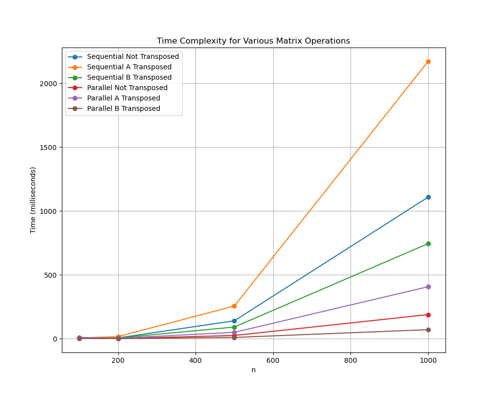

## Sequential Algorithms
My sequential algorithm simply initializes one instance of a Runnable child class of MatrixMultiplyInInterval that has a start of 0 and end of matrix.length, meaning it will multiply all rows in the matrix.

## Parallel algorithms
My solution splits up the matrix by rows and has every thread calculate the output for that the rows they are assigned. For example given n=8 and 4 cores, core 0 will calculate rows 0 and 1 sequentially, core 1 rows 2 and 3, etc. 

It also avoids a lot of the typical overhead in synchronizing threads by having a separate matrix as an output instead of doing it in place (sharing memory while using in place algorithms is also bug prone and unpredictable so it is something I avoid doing whenever possible). This means that the threads never have to synchronize (except for when they are done) after they are initialized because the data they are reading from is read only while for every row in the matrix there will only be one thread writing to it. This should make the algorithm significantly faster, but is a tradeoff for memory which is fine because speed is usually preferred over memory effeciency.

Therefore my parallelized algorithms are significantly faster than the sequential except for on very small matrices (when parallelizing the multiplication outperforms doing it sequentially will depend on the processor it runs on). The factor of which the parallelized algorithms are faster than the sequential ones also grow when n grows. For example for n=100 we can see that PARA_B_TRANSPOSED is ~2.4 times faster than SEQ_B_TRANSPOSED, but for n=2000 it is ~8 times faster

## Measurements:
Processor: AMD Ryzen 5 3600x 6 cores 12 threads @3.8GHz
(Times are in milliseconds)
| Algorithm               | n=100 | n=200 | n=500  | n=1000  | n=2000   |
|-------------------------|-------|-------|--------|---------|----------|
| **SEQ_NOT_TRANSPOSED**  | 6.67  | 6.70  | 140.84 | 1108.94 | 20834.93 |
| **SEQ_A_TRANSPOSED**    | 6.35  | 17.08 | 256.42 | 2172.49 | 34414.05 |
| **SEQ_B_TRANSPOSED**    | 6.14  | 6.16  | 91.92  | 745.11  | 6390.89  |
| **PARA_NOT_TRANSPOSED** | 10.76 | 1.94  | 25.71  | 189.32  | 2432.45  |
| **PARA_A_TRANSPOSED**   | 9.19  | 3.97  | 50.52  | 407.43  | 5164.66  |
| **PARA_B_TRANSPOSED**   | 2.53  | 1.52  | 10.64  | 71.25   | 805.67   |



On my computer SEQ_B_TRANSPOSED and PARA_B_TRANSPOSED break even around n=45. Divided by the amount of threads (12) = 3.75. So we can say that the parallel algorithm starts outperforming the sequential one whenever there are ~3-4 rows per thread

It's also noteworthy that for n=100 PARA_A_TRANSPOSED is consistently faster than PARA_NOT_TRANSPOSED. I'm guessing this is because for small values of n the data is close enough in memory so

## User guide:
I have included the file TestMatrix.java for getting benchmarks and verifying the outputs of different values of n. It gets values of n from the command line and runs the testForN method on all arguments. The `testForN` method simply initializes two matrices through the precodes `generateMatrixA` and `generateMatrixB` methods given the this constant seed:

```java
final int seed = 42;
```

It then multiplies them with each of the algorithms, verifying the results and printing the benchmarks to stdout. Example usage:

```sh
$ javac *.java
$ java TestMatrix 100 200 500 1000
```

Output should look something like this (numbers will be different):
```
-------TESTING FOR n=100-------
SEQ_NOT_TRANSPOSED:  6698650
SEQ_A_TRANSPOSED:    6617010
SEQ_B_TRANSPOSED:    6412950
PARA_NOT_TRANSPOSED: 13001051
PARA_A_TRANSPOSED:   2615612
PARA_B_TRANSPOSED:   25920121
-------TESTING FOR n=200-------
SEQ_NOT_TRANSPOSED:  8631424
SEQ_A_TRANSPOSED:    17042359
SEQ_B_TRANSPOSED:    6190661
PARA_NOT_TRANSPOSED: 2054193
PARA_A_TRANSPOSED:   4858696
PARA_B_TRANSPOSED:   1668695
-------TESTING FOR n=500-------
SEQ_NOT_TRANSPOSED:  142832296
SEQ_A_TRANSPOSED:    262223123
SEQ_B_TRANSPOSED:    92549189
PARA_NOT_TRANSPOSED: 29704089
PARA_A_TRANSPOSED:   54304515
PARA_B_TRANSPOSED:   14074638
-------TESTING FOR n=1000-------
SEQ_NOT_TRANSPOSED:  1230460814
SEQ_A_TRANSPOSED:    2307838387
SEQ_B_TRANSPOSED:    750293679
PARA_NOT_TRANSPOSED: 195532705
PARA_A_TRANSPOSED:   438728936
PARA_B_TRANSPOSED:   79008094
```

## Conclusion:
We can see that matrix multiplication is a problem easy and effective to parallelize. As soon as each thread has around 3-4 rows each it quickly starts outperforming the sequential algorithm.

Also, by sacrificing some memory you can often avoid large portions of parallelization overhead and also improve the predictability and readability of your code.
