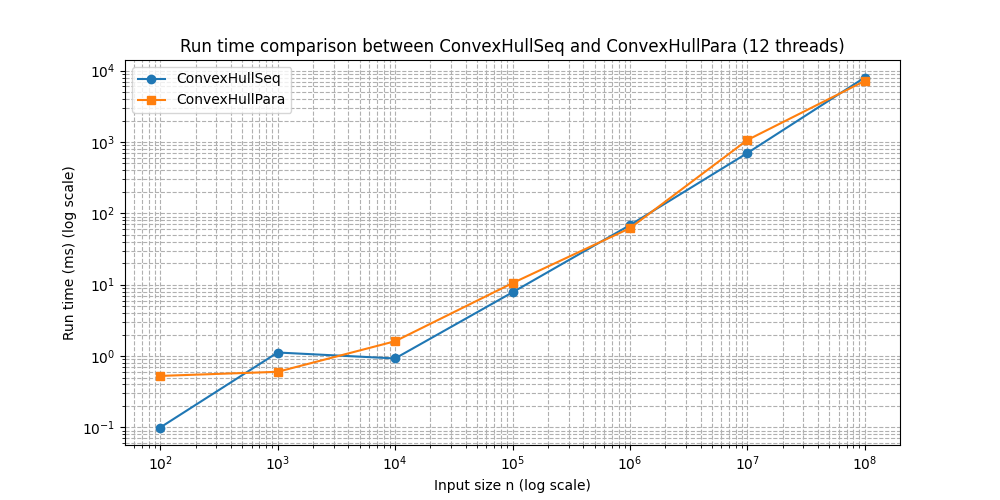
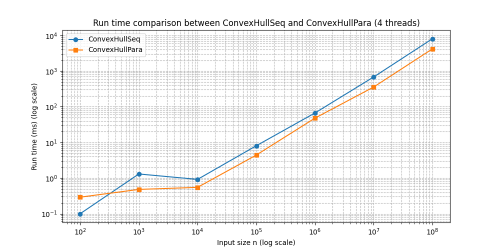

# IN3030 Oblig4 report - hermagst@uio.no
## User guide
To run the program use the main function inside the `ConvexHull.java` file. The `main` method takes 2 command line arguments: first `n` the number of points to generate, secondly `seed` the seed to use for generating the points using the `NPunkter` class in the precode. Both commandline arguments are expected to be integers. This will benchmark both the sequential and the parallel solution `N_TEST_RUNS` times and report the median run times over the runs. The parallel solution is hardcoded to use every available core - though you could easily change this by changing the initiliazation of the `threads` array in the `ConvexHullPara` constructor to some other value.

Example usage:
```sh
$ javac *.java

$ java ConvexHull 1000 2024
```

## Sequential solution
The sequential solution is a relatively simple recursive solution. It first finds the `argMax` and `argMin` of the x coordinates as we know these will be on the final hull. It then splits into two parts - one for finding the points above the line between the two first points (`visitAbove`) and one for finding the points below it (`visitBelow`). These parts will recursively find all points above and below the initial line.

## Parallel solution
The parallel solution tries to first do a sort of shallow BFS until it has reached a depth where it can start a thread for each branch within the search. It then starts a thread for each branch which does the same recursive search as the sequential solution, only difference being all visited points need to be added to a local visited `IntList` instead of the shared one as this would not be thread safe. When every thread is finished, the main thread then finally sequentially appends all the local visited lists into the shared one and then returns it.

I noticed that the performance of the parallel solution can be quite dependant of the shape of the graph its being run on. For example if there are some sections on the graph that have a lot of points on the hull and some points that have very few, the program will be bottlenecked by the threads working on the areas with many points.

Another weird thing I noticed is that the performance is oddly better when there are fewer threads. For example when initialized with 4 threads I the runtimes were significantly better than when I used all threads on my machine (12). This may be a similar issue to the one described above, where the parallel solution is dependant upon the shape of the graph and if there are many threads we will be doing a lot of unnecessary thread overhead for threads that are doing very little calculating.

## Run times
| Input Size (n) | sequential time (ms)  | 12 core parallel time (ms) | 4 core parallel time (ms) |
|----------------|-----------------------|----------------------------|---------------------------|
| 100            | 0.09958               | 0.526307                   | 0.291849                  |
| 1,000          | 1.120446              | 0.601108                   | 0.480538                  |
| 10,000         | 0.924767              | 1.611444                   | 0.549358                  |
| 100,000        | 7.816112              | 10.524821                  | 4.409414                  |
| 1,000,000      | 68.360861             | 61.973554                  | 47.877187                 |
| 10,000,000     | 700.041161            | 1066.546036                | 356.29518                 |
| 100,000,000    | 8021.676499           | 7177.863811                | 4170.588961               |



## Appendix
Following are the full command line outputs (for 4 cores)

```
$ java ConvexHull 100 2024
ConvexHullSeq median time over 7 test runs: 0.10004ms
ConvexHullPara median time over 7 test runs: 0.291849ms

$ java ConvexHull 1000 2024
ConvexHullSeq median time over 7 test runs: 1.303025ms
ConvexHullPara median time over 7 test runs: 0.480538ms

$ java ConvexHull 10000 2024
ConvexHullSeq median time over 7 test runs: 0.918237ms
ConvexHullPara median time over 7 test runs: 0.549358ms

$ java ConvexHull 100000 2024
ConvexHullSeq median time over 7 test runs: 8.04628ms
ConvexHullPara median time over 7 test runs: 4.409414ms

$ java ConvexHull 1000000 2024
ConvexHullSeq median time over 7 test runs: 66.799768ms
ConvexHullPara median time over 7 test runs: 47.877187ms

$ java ConvexHull 10000000 2024
ConvexHullSeq median time over 7 test runs: 681.985109ms
ConvexHullPara median time over 7 test runs: 356.29518ms

$ java ConvexHull 100000000 2024
ConvexHullSeq median time over 7 test runs: 8031.169317ms
ConvexHullPara median time over 7 test runs: 4170.588961ms
```
