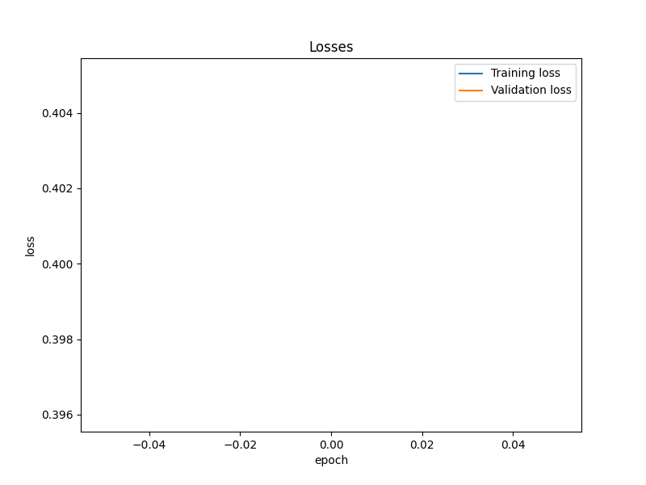
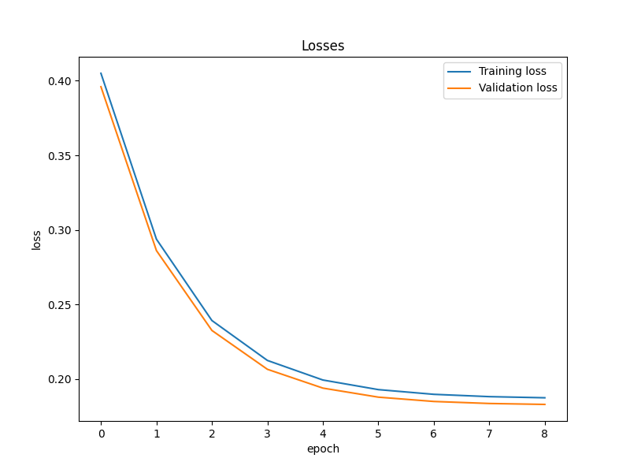
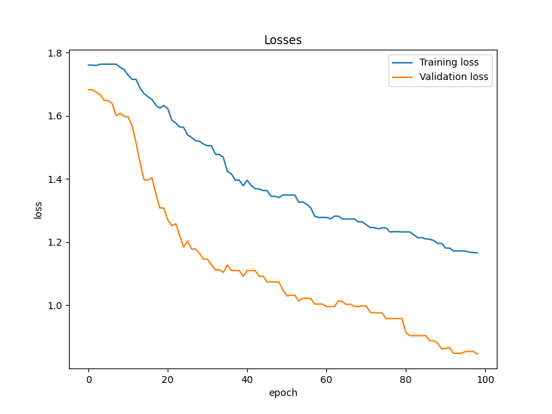
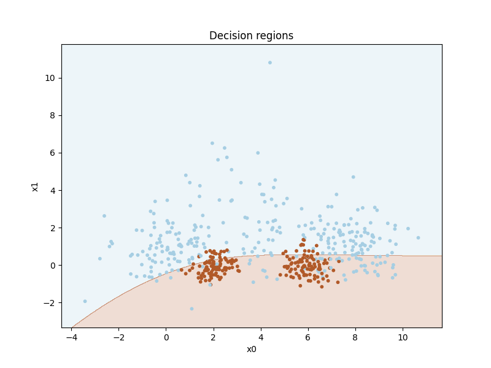
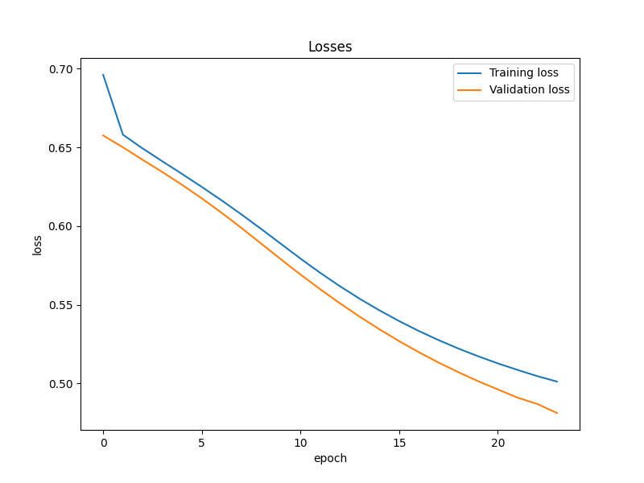

# IN3050 Assignment 2 - hermagst
This report is merely a collection of comments from the code, that are sorted by their tasks for easier lookup. I have also included all the graphs that will be generated if you were to run the code and put them alongside appropriate comments/tasks. Everything here is just copied from comments inside `main.py`.

To see more detailed reports from each algorithm run the following command in your shell (make sure to have numpy installed or be in a virtualenv with it):
```sh
$ python main.py
```
That should generate graphs under the `assets/` directory and should output something like this:

```
Testing linear classifier without scaling
Best accuracy after training:       0.604
Best parameters:                    best_epochs=1, best_learning_rate=0.0001, best_tol=0.0001
Final accuracy on test set:         0.606
Loss change for validation set:     0.396 -> 0.396
Accuracy change for validation set: 0.604 -> 0.604
Number of trained epochs:           1
Algorithm has no true guesses, cannot calculate precision and recall

Testing linear classifier with standard scaling
Best accuracy after training:       0.762
Best parameters:                    best_epochs=9, best_learning_rate=0.3, best_tol=0.0001
Final accuracy on test set:         0.714
Loss change for validation set:     0.396 -> 0.183
Accuracy change for validation set: 0.604 -> 0.744
Number of trained epochs:           9
Precision on test set:              0.6646341463414634
Recall on test set:                 0.5532994923857868

Testing linear classifier with minmax scaler
Best accuracy after training:       0.708
Best parameters:                    best_epochs=66, best_learning_rate=0.5, best_tol=0.0001
Final accuracy on test set:         0.586
Loss change for validation set:     0.396 -> 0.228
Accuracy change for validation set: 0.604 -> 0.698
Number of trained epochs:           66
Precision on test set:              0.4
Recall on test set:                 0.10152284263959391

Testing binary logistic classifier with standard scaling
Best accuracy after training:       0.764
Best parameters:                    best_epochs=56, best_learning_rate=0.5, best_tol=0.0001
Final accuracy on test set:         0.722
Loss change for validation set:     0.693 -> 0.498
Accuracy change for validation set: 0.604 -> 0.762
Number of trained epochs:           56
Precision on test set:              0.6526315789473685
Recall on test set:                 0.6294416243654822

Testing multi class logistic classifier with standard scaling
Best accuracy after training:       0.82
Best parameters:                    best_epochs=99, best_learning_rate=0.5, best_tol=0.0001
Final accuracy on test set:         0.782
Loss change for validation set:     1.682 -> 0.846
Accuracy change for validation set: 0.708 -> 0.820
Number of trained epochs:           456

Testing binary multi layer perceptron with no scaling
Best accuracy after training:       0.838
Best parameters:                    best_epochs=31, best_learning_rate=0.01, best_tol=0.01
Final accuracy on test set:         0.606
Loss change for validation set:     0.666 -> 0.478
Accuracy change for validation set: 0.604 -> 0.838
Number of trained epochs:           31
Algorithm has no true guesses, cannot calculate precision and recall

Testing binary multi layer perceptron with standard scaling
Best accuracy after training:       0.848
Best parameters:                    best_epochs=90, best_learning_rate=0.01, best_tol=0.0005
Final accuracy on test set:         0.518
Loss change for validation set:     0.681 -> 0.400
Accuracy change for validation set: 0.604 -> 0.848
Number of trained epochs:           90
Precision on test set:              0.4051724137931034
Recall on test set:                 0.47715736040609136

Getting mean and standard deviation of accuracy for given parameters
Standard deviation 0.016, mean 0.802
```

<!-- <div style="page-break-after: always;"></div> -->

## Task 1
### 1.0.2
When first running the below code with testing for epochs from 1..100 I
found that pretty much any training would decrease the accuracy of the
model. The best we could do was get the same accuracy as with an untrained
classifier. However after increasing the amount of epochs to 200 I finally
found an accuracy ever so slightly better than default. With a learning
rate of 0.01 and 194 epochs we can get an accuracy of 0.61.
(this is compared to the default value of 0.604). I ended up reverting
back to 100 epochs however as 200 took too long and would lead to
number overflow errors. I later also realised even 100 epochs caused
over specialization to the train/validation sets, so 200 would be no good.
These results were found by brute forcing different combinations in the 
`test_classifier` function


<br>
The losses for this is empty which makes sense because we're not actually training anything


<div style="page-break-after: always;"></div>

### 1.0.3
The optimal parameters for the linear classifier scaled with the standard
scaler are 9 epochs with a learning rate of 0.3 resulting in an accuracy
of 0.762, and for the minmax scaler its 66 epochs and a learning rate of
0.5 resulting in an accuracy of 0.708. Both are significant improvements
compared to the unscaled data. These results were found by brute forcing
different combinations in the `test_classifier` function

NOTE: I also noticed that by modifying the threshold of the predict
function of the classifier we could further increase the accuracy on the
standard scaled data. Here i found that ~0.45 would be the optimal 
resulting in an accuracy of 0.79. Though this is definetly specific to
this dataset so i left it out from the definition of the classifier.

<h4>Standard scaling</h4>


<div style="page-break-after: always;"></div>
<h4>Minmax scaling</h4>


### 1.1
For the logistic regression classifier we find the optimal paramters to be
104 epochs with a learning rate of 0.5 resulting in an accuracy of 0.766.

From the plotting of the losses i noticed that some of the classifiers
grow to get a lower loss on the validation set than the training set which
is somewhat unexpected though not unheard of. All the curves are monotone
as the loops above will always choose the best classifier after brute forcing
the best parameters, meaning if there is a combination where the graph is not
monotone there will always be a combination with fewer epochs that will stop
before the graph changes direction. There could theoretically be a combination
where the graph briefly changed in the wrong direction, but then later
changes back (graph overcomes local optima), but all these combinations would
be eliminated by the early stopping implemented in task 1.1e.

#### Logistic regression with standard scaling


### 1.2
Running this test takes a bit longer than the binary classifiers, because
we are running several binary classifiers sequentially. The optimal
parameters for this algorithm are 99 epochs with a learning rate of 0.5
resulting in an accuracy of 0.82. If we remove the tracking of losses
and accuracies while training and just train the binary classifiers
fully instead of 1 epoch at a time we can also reduce the runtime by ~4x

#### One vs rest with logistic regression + standard scaling



<div style="page-break-after: always;"></div>

## Task 2 & 3
The best parameters will vary based on the randomness in the classifier's initialization
so we cannot really know the actual best parameters for certain. This will find the
parameters that were best for this call of `test_classifier` and then try those params
again 10 times and report the mean and standard deviation for that.

Running the MLP without scaling or regularization will result in a number overflow for
larger values of epochs, regardless it will finish with mostly fine results, though
expectedly slightly worse than with scaled data

The standard deviation will likely be higher when testing classifiers with a lower number
of epochs, in which case the good result is likely a result of rolling a good random seed.
However if we keep the range of tested epochs at a decent size (100 above) we will most
likely have a relatively low standard deviation and a mean close to the best result.

#### Binary Multi Layer Perceptron



## Task 4
The three algorithms have vastly different results, and the difference between non-
scaled and scaled datasets is significant (using non scaled datasets also proved to
lead to number overflows). I also noticed how terribly the algorithms performed when
given the opportunity to optimize for the validation set and I had probably set the
the range of epochs to test for (100) too high, however this is a number that's easy
to tweak after developing the classifiers. When setting this number to something
lower like 20, all the numbers in the benchmark shuffle around dramatically.
Here the best accuracy on the validation set drops, the accuracy on the test set
increases (though is still somewhat low for some algorithms, some of them even
being below 50% when testing for up to 20 epochs), and of course the runtimes
are drastically shorter since we don't have to test as many combinations.
